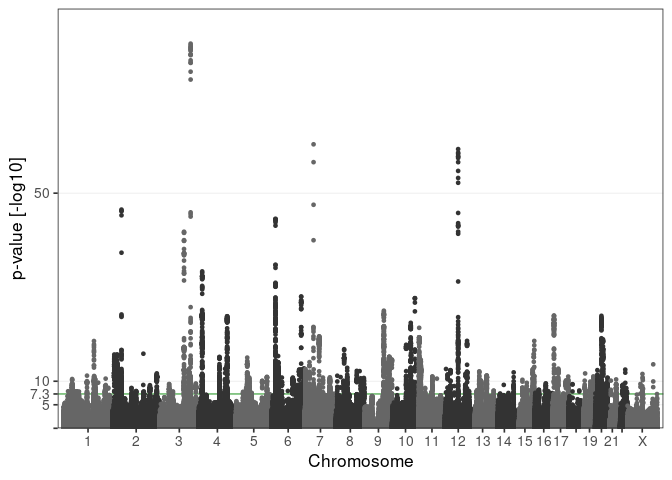
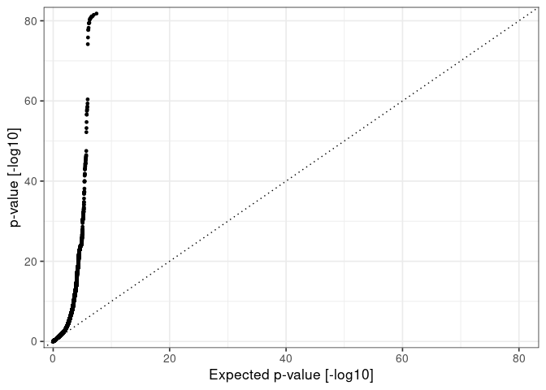
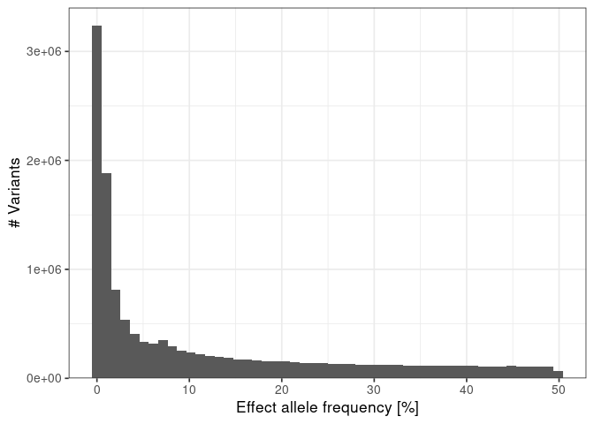
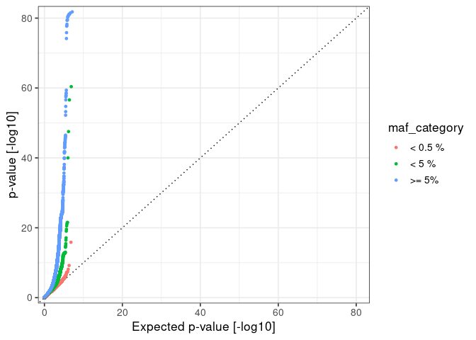
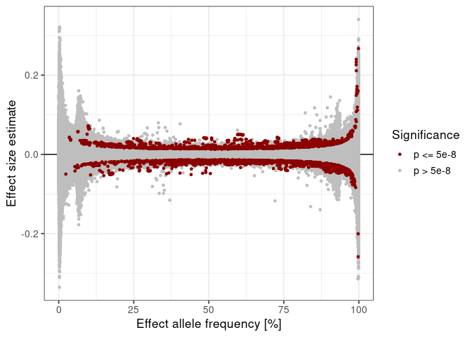
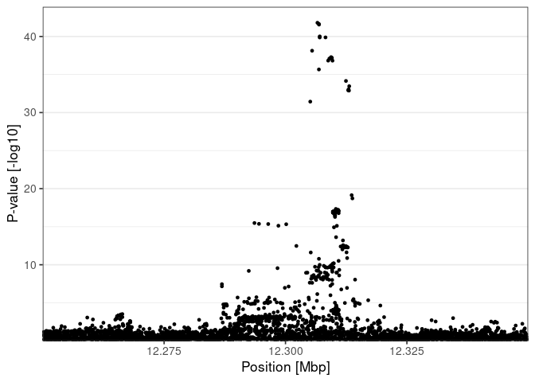
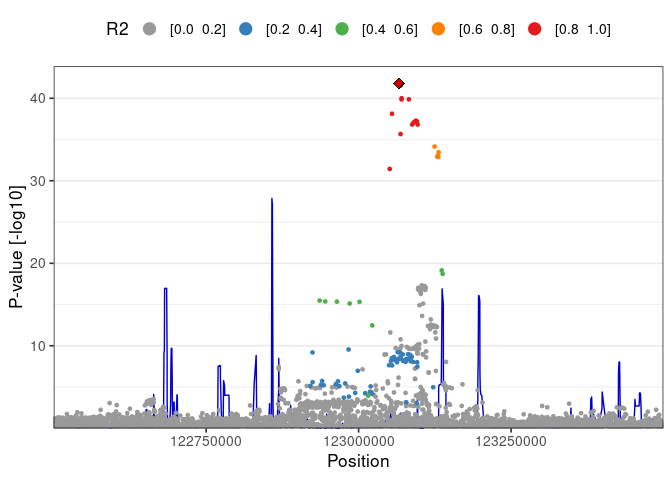

## Inspecting GWAS summary statistics

This notebook provides and introduction to inspecting the results of
genome-wide association studies.

## Libraries

We will need the following libraries. If they are not availble on your
system, use the `ìnstall_packages` command to install them.

    library(janitor) # A package to clean dirty data

    ## 
    ## Attaching package: 'janitor'

    ## The following objects are masked from 'package:stats':
    ## 
    ##     chisq.test, fisher.test

    library(tidyr) # A package to tidy data
    library(dplyr) # A package to manipulate data

    ## 
    ## Attaching package: 'dplyr'

    ## The following objects are masked from 'package:stats':
    ## 
    ##     filter, lag

    ## The following objects are masked from 'package:base':
    ## 
    ##     intersect, setdiff, setequal, union

    library(parallel) # A package to run tasks in parallel
    library(glue) # A package to glue variables in strings

    library(curl) # A package to connect to urls

    ## Using libcurl 7.68.0 with OpenSSL/1.1.1f

    library(httr) # A package to run http queries

    ## 
    ## Attaching package: 'httr'

    ## The following object is masked from 'package:curl':
    ## 
    ##     handle_reset

    library(rjson) # A package to handle json files

    library(LDlinkR) # A package to query LDlink
    library(phenoscanner) # A package to query phenoscanner  NOTE: phenoscanner needs to be installed from https://github.com/phenoscanner/phenoscanner

    library(ggplot2) # A package to plot data
    library(scico) # A package of scientific color palettes
    library(RColorBrewer) # A package of color palettes

    library(conflicted) # A package to manage namespace conflicts

    # Resolve conflicting function names
    conflict_prefer("filter", "dplyr")

    ## [conflicted] Will prefer dplyr::filter over any other package

    # Set the theme for plots
    theme_set(theme_bw(base_size = 13))

    # Ensembl rest APIs
    server <- "https://rest.ensembl.org"
    server37 <- "https://grch37.rest.ensembl.org"

## Inspecting GWAS summary statistics

Load results from the birth weight GWAS available at this
[link](https://drive.google.com/file/d/1mn64G91258pDdDARVAS1cYlcof-Knu2n/view?usp=sharing).

    file_path <- "/home/marc/Projects/tutorials/data/Fetal_BW_European_meta.NG2019.txt.gz"

    gwas_results <- read.table(
      file = file_path,
      header = T,
      sep = " ",
      stringsAsFactors = F
    ) %>% 
      clean_names()

*Do you understand the meaning of the different columns? Is there
anything that you find surprising?*

Build a Manhattan plot. Note: there are dedicated packages that can do
this but for the sake of the exercise we will write down the code.

    # Chromosome lengths in GRCh37.p13 (hg19) from Ensembl

    chromosomes <- c("1", "2", "3", "4", "5", "6", "7", "8", "9", "10", "11", "12", "13", "14", "15", "16", "17", "18", "19", "20", "21", "22", "X")
    chromosomeLength <- c(249250621, 243199373, 198022430, 191154276, 180915260, 171115067, 159138663, 146364022, 141213431, 135534747, 135006516, 133851895, 115169878, 107349540, 102531392, 90354753, 81195210, 78077248, 59128983, 63025520, 48129895, 51304566,    155270560)
    genomeLength <- sum(chromosomeLength)
    chromosomeStart <- cumsum(chromosomeLength) - chromosomeLength
    chromosomeMiddle <- chromosomeStart + chromosomeLength / 2

    # Arrange for plotting

    plot_data <- gwas_results %>%
      mutate(
        logP = -log10(p)
      ) %>% 
      arrange(
        logP
      ) %>%
      mutate(
        chromosomeNumber = as.numeric(ifelse(chr == 'X', 23, chr)),
        x = chromosomeStart[chromosomeNumber] + pos,
        color = factor(chromosomeNumber %% 2, levels = 0:1)
      ) %>%
      arrange(
        chromosomeNumber, logP, pos
      )

    maxP <- max(plot_data$logP)

    # Colors

    mhColor1 <- "grey20"
    mhColor2 <- "grey40"
    colors <- c(mhColor1, mhColor2)

    # Chromosome labels

    xLabels <- 1:22
    xLabels[xLabels %% 2 == 0 & xLabels > 17] <- ""
    xLabels <- c(xLabels, "X")

    # y axis

    maxY <- 5 * ceiling(max(plot_data$logP / 5))
    maxY <- max(maxY, 10)

    yBreaks <- c(0, 5, -log10(5e-8))
    yLabels <- c("", 5, round(-log10(5e-8), digits = 1))

    lastBreak <- floor(max(maxY / 10))

    if (lastBreak > 0) {
      
      newBreaks <- 10*(1:lastBreak)
      
      while(length(newBreaks) > 3) {
        
        newBreaks <- newBreaks[c(T, F)]
        
      }
      
      yBreaks <- c(yBreaks, newBreaks)
      yLabels <- c(yLabels, round(newBreaks, digits = 1))
      
    }

    # Build plot
    ggplot(
      data = plot_data
    ) + 
      geom_hline(
        yintercept = -log10(5e-8), 
        col = "green4", 
        size = 0.3
      ) + 
      geom_point(
        aes(
          x = x, 
          y = logP, 
          col = color
        ), 
        size = 1
      ) +
      scale_y_continuous(
        name = "p-value [-log10]", 
        breaks = yBreaks, 
        labels = yLabels, 
        expand = expansion(
          mult = c(0, 0.05)
        ), 
        limits = c(0, maxY)
      ) + 
      scale_x_continuous(
        name = "Chromosome", 
        breaks = chromosomeMiddle, 
        labels = xLabels, 
        limits = c(0, genomeLength), 
        expand = expansion(
          mult = 0.01
        )
      ) + 
      scale_color_manual(
        values = colors
      ) + 
      theme(
        legend.position = "none",
        panel.grid.minor = element_blank(),
        panel.grid.major.x = element_blank(),
        panel.grid.major.y = element_line(size = 0.3),
        strip.background = element_rect(
          fill = "grey99"
        )
      )

Build a QQ plot. Note: there are dedicated packages that can do this but
for the sake of the exercise we will write down the code.

    # Compute expected p-values

    plot_data <- gwas_results %>%
      mutate(
        logP = -log10(p)
      ) %>% 
      arrange(
        logP
      ) %>% 
      mutate(
        expectedLogP = sort(-log10(ppoints(n = n())))
      )

    # Axis

    maxValue <- max(plot_data$logP, plot_data$expectedLogP, 10)

    # Build plot
    ggplot(
      data = plot_data
    ) + 
      geom_abline(
        slope = 1,
        intercept = 0,
        linetype = "dotted"
      ) +
      geom_point(
        mapping = aes(
          x = expectedLogP,
          y = logP
        ),
        size = 1
      ) +
      scale_y_continuous(
        name = "p-value [-log10]", 
        limits = c(0, maxValue),
        expand = expansion(
          mult = 0.02
        )
      ) +
      scale_x_continuous(
        name = "Expected p-value [-log10]",
        limits = c(0, maxValue),
        expand = expansion(
          mult = 0.02
        )
      )

Build a histogram of allele frequencies.

    # Compute the maf
    plot_data <- plot_data %>% 
      mutate(
        minor_allele_frequency = ifelse(eaf > 0.5, 1 - eaf, eaf)
      )

    # Build histogram
    ggplot(
      data = plot_data
    ) + 
      geom_histogram(
        mapping = aes(
          x = 100 * minor_allele_frequency,
        ),
        size = 1,
        bins = 50
      ) +
      scale_y_continuous(
        name = "# Variants",
        expand = expansion(
          mult = c(0, 0.05)
        )
      ) +
      scale_x_continuous(
        name = "Effect allele frequency [%]"
      )

This study included variants down to a minor allele frequency of 0.1 %.

Build some maf categories.

    # Compute the maf
    plot_data <- plot_data %>% 
      mutate(
        maf_category = case_when(
          minor_allele_frequency < 0.005 ~ "< 0.5 %",
          minor_allele_frequency < 0.05 ~ "< 5 %",
          T ~ ">= 5%"
        ),
        maf_category = factor(maf_category, levels = c("< 0.5 %", "< 5 %", ">= 5%"))
      )

    table(plot_data$maf_category)/nrow(plot_data)

    ## 
    ##   < 0.5 %     < 5 %     >= 5% 
    ## 0.2307666 0.2747280 0.4945054

Build a QQ plot stratifying the variants per maf category.

    # Compute expected p-values

    plot_data_stratified <- plot_data %>%
      group_by(
        maf_category
      ) %>% 
      arrange(
        logP
      ) %>% 
      mutate(
        expectedLogP = sort(-log10(ppoints(n = n())))
      ) %>% 
      ungroup()

    # Axis

    maxValue <- max(plot_data_stratified$logP, plot_data_stratified$expectedLogP, 10)

    # Build plot
    ggplot(
      data = plot_data_stratified
    ) + 
      geom_abline(
        slope = 1,
        intercept = 0,
        linetype = "dotted"
      ) +
      geom_point(
        mapping = aes(
          x = expectedLogP,
          y = logP,
          col = maf_category
        ),
        size = 1
      ) +
      scale_y_continuous(
        name = "p-value [-log10]", 
        limits = c(0, maxValue),
        expand = expansion(
          mult = 0.02
        )
      ) +
      scale_x_continuous(
        name = "Expected p-value [-log10]",
        limits = c(0, maxValue),
        expand = expansion(
          mult = 0.02
        )
      )

Plot the effect size estimate against the effect allele frequency.

    # Color the genome-wide significant hits differently

    plot_data <- plot_data %>% 
      mutate(
        gwas_significant = ifelse(p <= 5e-8, "p <= 5e-8", "p > 5e-8"),
        gwas_significant = factor(gwas_significant, levels = c("p <= 5e-8", "p > 5e-8"))
      )

    # Build plot
    ggplot(
      data = plot_data
    ) + 
      geom_hline(
        yintercept = 0
      ) +
      geom_point(
        mapping = aes(
          x = 100 * eaf,
          y = beta,
          col = gwas_significant
        ),
        size = 1
      ) +
      scale_y_continuous(
        name = "Effect size estimate"
      ) +
      scale_x_continuous(
        name = "Effect allele frequency [%]"
      ) +
      scale_color_manual(
        name = "Significance",
        values = c("darkred", "grey")
      )

## Zooming in on a specfic signal

We will now focus on the region around 123 Mbp.

    region_data <- read.table(
      file = "resources/region_data.gz",
      header = T,
      sep = "\t",
      stringsAsFactors = F
    )

    # Build plot
    ggplot(
      data = region_data
    ) + 
      geom_point(
        mapping = aes(
          x = pos/10e6,
          y = -log10(p)
        ),
        size = 1
      ) +
      scale_x_continuous(
        name = "Position [Mbp]",
        expand = c(0, 0)
      ) +
      scale_y_continuous(
        name = "P-value [-log10]",
        expand = expansion(
          mult = c(0, 0.05)
        )
      ) + 
      theme(
        panel.grid.major.x = element_blank(),
        panel.grid.minor.x = element_blank()
      )

Find the rsid of the variant with best p-value in that region.

    best_rsid <- region_data$rsid[which.min(region_data$p)]

*Look for the variants in LD with this SNP using LDlink - how would you
do this for hundreds of variants?*

Find the variants in LD with this variant using LDlink.

    window <- "500000"
    token <- "b823fa70d49d" # Note: you should get your own authentification token from LDlink

    ld_resutls <- LDproxy(
      snp = best_rsid, 
      pop = "CEU", 
      r2d = "r2", 
      token = token
    ) %>% 
      clean_names()

    ## 
    ## LDlink server is working...

Annotate the LD with the lead SNP on the plot and add recombination
rates.

    # Merge LD values

    r2_values <- ld_resutls %>% 
      select(
        rsid = rs_number, ld = r2
      )

    plot_data <- region_data %>% 
      left_join(
        r2_values,
        by = "rsid"
      ) %>% 
      mutate(
        ld = ifelse(is.na(ld), 0, ld),
        ldFactor = case_when(
          ld < 0.2 ~ "[0.0  0.2]",
          ld >= 0.2 & ld < 0.4 ~ "[0.2  0.4]",
          ld >= 0.4 & ld < 0.6 ~ "[0.4  0.6]",
          ld >= 0.6 & ld < 0.8 ~ "[0.6  0.8]",
          ld >= 0.8 ~ "[0.8  1.0]"
        ),
        ldFactor = factor(ldFactor, c("[0.0  0.2]", "[0.2  0.4]", "[0.4  0.6]", "[0.6  0.8]", "[0.8  1.0]"))
      ) %>% 
        arrange(
            ldFactor
        )

    lead_snp <- plot_data %>% 
      filter(
        rsid == best_rsid
      )

    bestP <- max(-log10(lead_snp$p))

    # Get recombination rates

    recombination_rates <- read.table(
      file = "resources/recombination_rates/genetic_map_GRCh37_chr3.txt.gz",
      header = T,
      sep = "\t",
      stringsAsFactors = F
    ) %>% 
      clean_names() %>% 
      filter(
        position_bp >= min(plot_data$pos) & position_bp <= max(plot_data$pos)
      ) %>% 
      mutate(
        recombination_rate_scaled = rate_c_m_mb / max(rate_c_m_mb) * bestP * 2 / 3
      )

    # Build plot
    ggplot() + 
      geom_line(
        data = recombination_rates,
        mapping = aes(
          x = position_bp,
          y = recombination_rate_scaled
        ),
        col = "blue3"
      ) +
      geom_point(
      data = plot_data,
        mapping = aes(
          x = pos,
          y = -log10(p),
          col = ldFactor
        ),
        size = 1
      ) +
        geom_point(
            data = lead_snp,
            mapping = aes(
          x = pos,
          y = -log10(p)
            ),
            shape = 18,
            col = "black",
            size = 4
        ) +
        geom_point(
            data = lead_snp,
            mapping = aes(
          x = pos,
          y = -log10(p)
            ),
            shape = 18,
            col = "red3",
            size = 3
        ) +
      scale_x_continuous(
        name = "Position",
        expand = c(0, 0)
      ) +
      scale_y_continuous(
        name = "P-value [-log10]",
        expand = expansion(
          mult = c(0, 0.05)
        )
      ) +
        scale_color_manual(
            name = "R2",
            values = brewer.pal(9, "Set1")[c(9, 2, 3, 5, 1)],
            guide = guide_legend(
                override.aes = list(
                    size = 4
                )
            )
        )  + 
      theme(
        legend.position = "top",
        panel.grid.major.x = element_blank(),
        panel.grid.minor.x = element_blank()
      )

*Look for the possible consequences of this variant in Ensembl - how
would you do this for hundreds of variants?*

Do this with the Ensembl API.

    ext <- "/vep/human/id"
    body <- paste0('{ "ids" : ["', best_rsid, '" ] }') # Note that you can query multiple variants, just separate their ids with commas

    r <- POST(
      url = paste(server37, ext, sep = ""), 
      content_type("application/json"), 
      accept("application/json"), 
      body = body
    )

    response_code <- status_code(r)

    if (response_code != 200) {
      
      stop(paste0("Ensembl query failed for ", best_rsid, ". Status: ", responseCode, "."))
      
    }

    vep_results <- fromJSON(toJSON(content(r)))

*Do you find the possible consequences?*

Similarly, query the genes in this region.

    chromosome <- 3
    position <- region_data$pos[region_data$rsid == best_rsid]
    position_start <- max(position - 500000, 0)
    position_end <- position + 500000

    region <- paste0(chromosome, ":", position_start, "-", position_end)

    ext <- paste0("/overlap/region/human/", region, "?feature=gene")

    r <- GET(
      url = paste(server37, ext, sep = ""), 
      content_type("application/json"), 
      accept("application/json")
    )

    response_code <- status_code(r)

    if (response_code != 200) {
      
      stop(paste0("Ensembl query failed for ", best_rsid, ". Status: ", responseCode, "."))
      
    }

    gene_results <- fromJSON(toJSON(content(r)))

*What is the nearest gene?*

Now, see whether this variant was associated with other traits using
phenoscanner.

    phenoscanner_results <- phenoscanner(
      snpquery = best_rsid,
      proxies = "EUR",
      pvalue = 5e-8
    )

    ## PhenoScanner V2
    ## Cardiovascular Epidemiology Unit
    ## University of Cambridge
    ## Email: phenoscanner@gmail.com
    ## 
    ## Information: Each user can query a maximum of 10,000 SNPs (in batches of 100), 1,000 genes (in batches of 10) or 1,000 regions (in batches of 10) per hour. For large batch queries, please ask to download the data from www.phenoscanner.medschl.cam.ac.uk/data.
    ## Terms of use: Please refer to the terms of use when using PhenoScanner V2 (www.phenoscanner.medschl.cam.ac.uk/about). If you use the results from PhenoScanner in a publication or presentation, please cite all of the relevant references of the data used and the PhenoScanner publications: www.phenoscanner.medschl.cam.ac.uk/about/#citation.
    ## 
    ## [1] "rs11708067 -- queried"

    View(phenoscanner_results$results)

*How many other traits are associated with this variant?*
