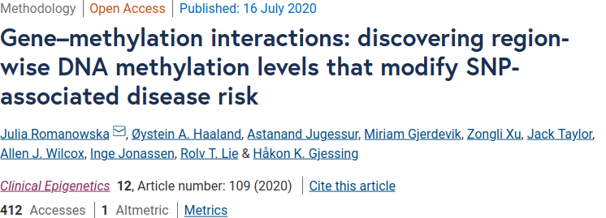
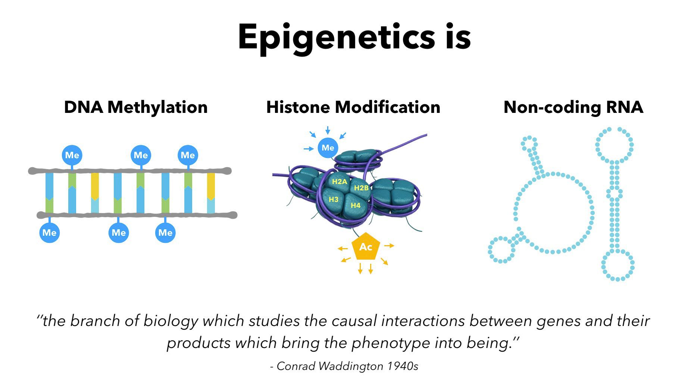
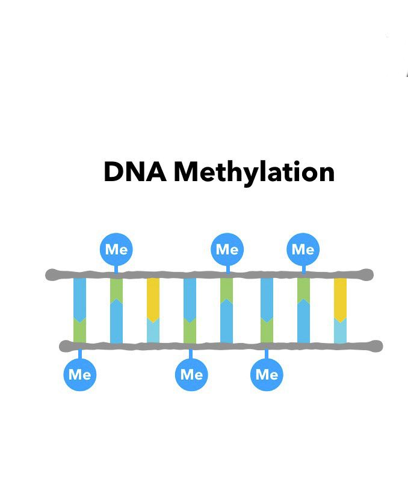
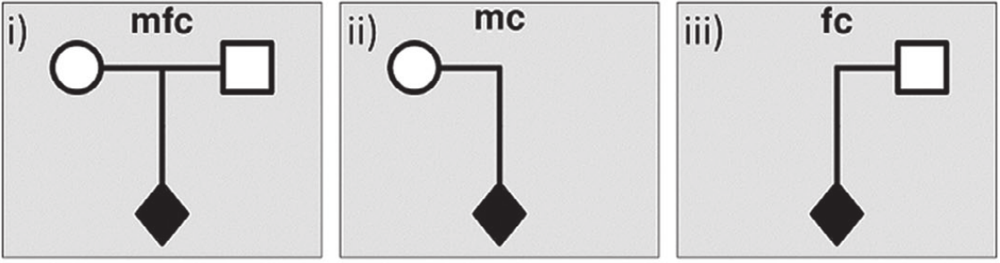
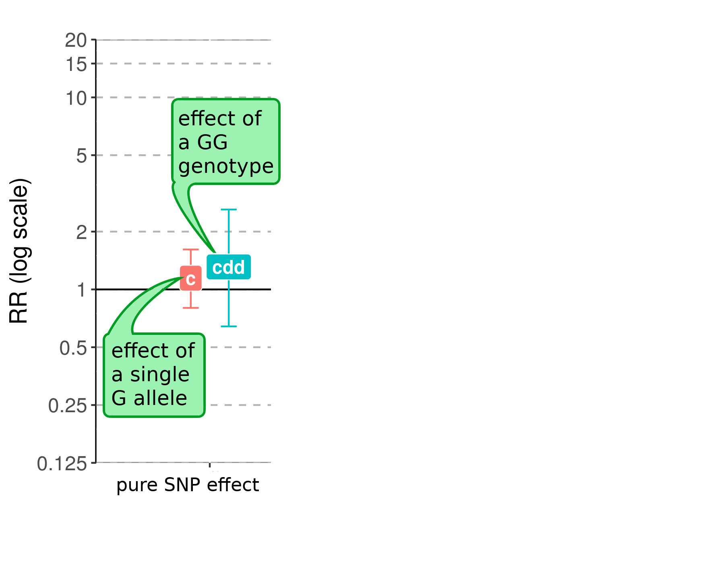
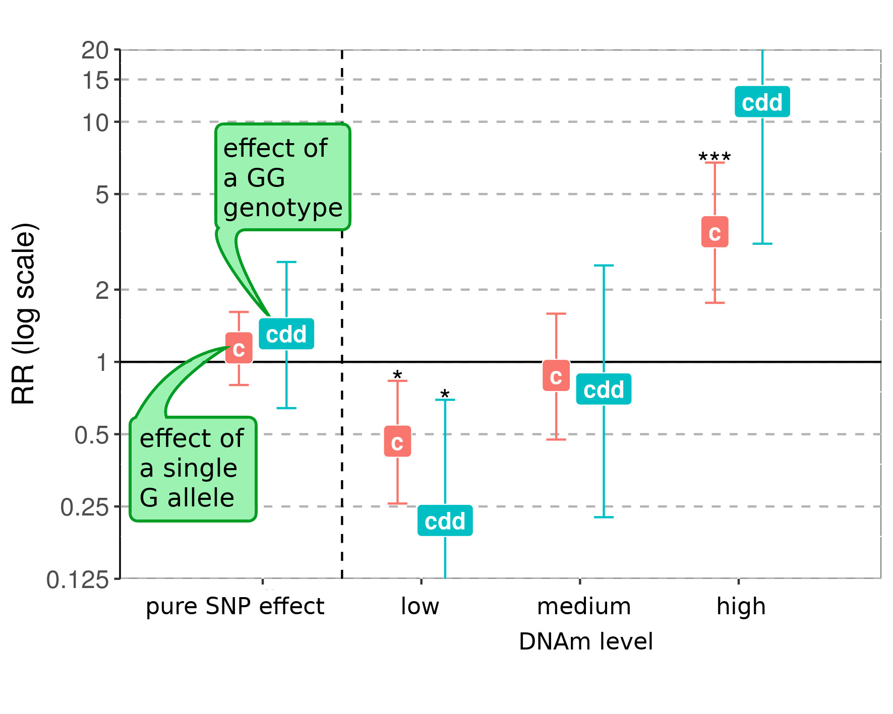
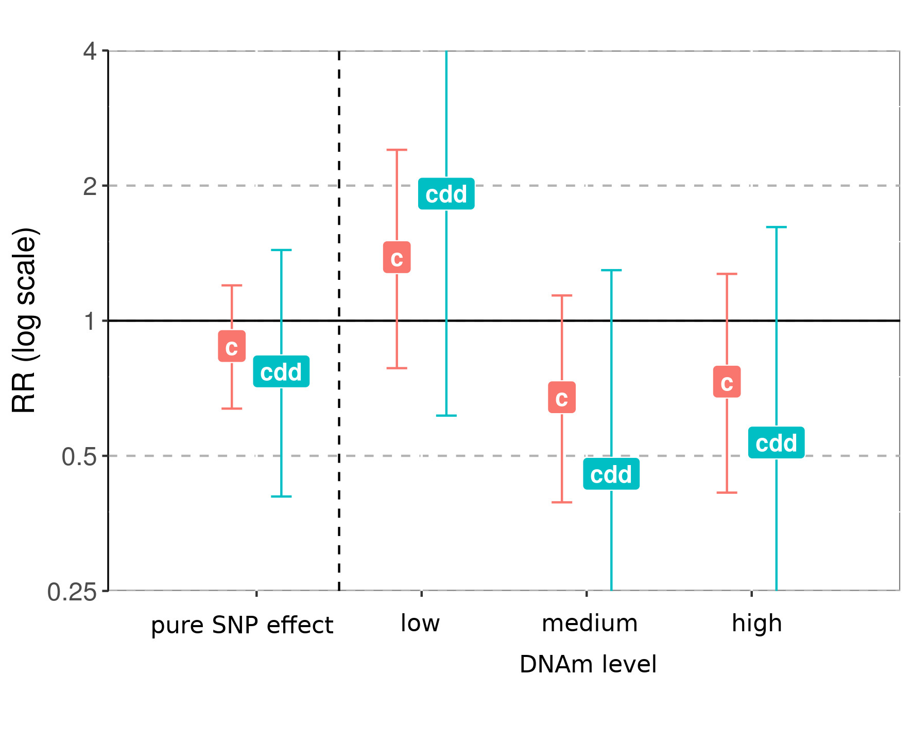
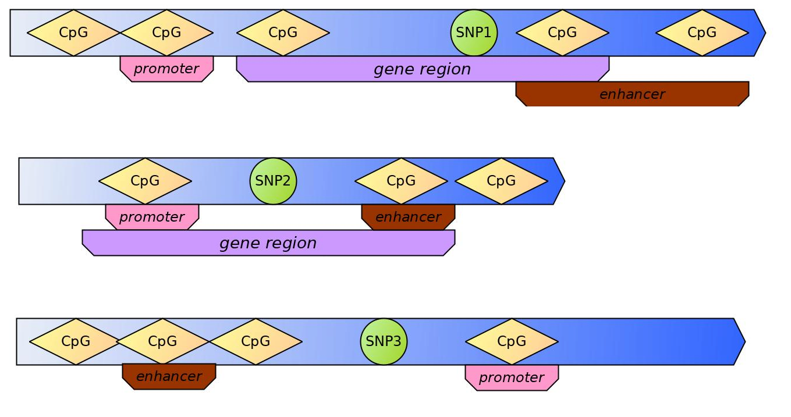

```{r setup, include=FALSE}
options(htmltools.dir.version = FALSE)
library(xaringanthemer)
style_solarized_light()
xaringanExtra::use_clipboard()
xaringanExtra::use_fit_screen()
```

class: left, inverse, bottom



# OVERVIEW

## Background
## New methods
## Challenges
## Interpretation

???

The article has just been published, and I am grateful for having all the wonderful co-authors on board. It was not an easy task, but we managed it!

I will guide you through the most interesting parts of the methodology we describe in the article, but I encourage you to read it and do not hesitate to contact me if you found any mistakes, bugs, or just want to comment on it. When designing the method and putting it into a paper, we had many discussions and we think that it's generally so difficult to describe, quantify, and interpret results of using DNA methylation data, and we would really like this article to be, apart from a description of a new methodology, an invitation to discussion.

---

## Background


<p style="font-size: small; font-style: italic; text-align: right;">src: Pinterest by Pine BioTech</p>

???

As we know, the era of focusing only on genetic data is over. Since the first measurement of epigenetic marks, it has been known that interpretation of the genetic code is not trivial. Genes encode proteins, but there is so much more than genes in our DNA! And around it, the entricate machinery regulating gene expression can be triggered to enhance or to halten specific transcription processes.

DNA can be marked with methyl groups, a process known as DNA methylation. Specific protein sites on the histones can be marked with either methyl or acetyl groups. Small RNA chains can bind to specific DNA regions. These **epigenetic marks** somehow start or stop gene expression.

Out of those epigenetic marks, DNA methylation is the most studied and as such received a lot of attention lately...

---

## Background



- after a busy GWAS period...
- bead-chip technology enables fast measurements of DNA methylation (DNAm)    
on ~800 thousands *CpGs* (methylation sites)    
and in thousands of *samples* (individuals)
- **EWAS** = epigenome-wide association study:    
*instead of Single Nucleotide Polymorphisms (SNPs), we now have methylation sites (CpGs)*
- **problem:** *lots of data, lots of single-site associations, no conclusions*

???

Namely, the development of a relatively cheap technology to measure DNA methylation levels on a genome-wide scale led to an explosion in the amount of studies that used these on the samples from individuals they had access to.

Applying the same technique as for the genome-wide data that estimated associations of SNPs with a phenotype, researchers were eager to check for associations between a phenotype and single methylation sites, CpGs.

After the first fever has declined, we now see that what we're left with is a plethora of almost irrelevant data without really insightful, complete conclusions.

--

<br>
<br>
<br>
<br>
> We need methods to *combine* genome-wide and epigenome-wide measurements to predict disease risk

???

That's why now comes the third era - integrating these two genome-wide measurements to fully use their potential.

---

### Combining genome- and epigenome-wide data

**Existing approaches:**

- linear regression:
  1. test for DNAm-trait association
  2. test for genotype-DNAm association
- check DNAm around associated SNPs
- find differentially methylated CpGs and check for association with genotype
- find the SNP-CpG pairs associated with a trait (meQTL)

<p style="font-size: small; font-style: italic;">exemplary refs: 1) <a href="https://doi.org/10.1016/j.ajhg.2015.05.014">Shah S, et al. Am J Hum Genet. 2015; 97(1):75–85.</a>,
2) <a href="https://doi.org/10.1371/journal.pmed.1002287">White CC, et al. PLOS Med. 2017; 14(4):1002287.</a>,
3) <a href="https://doi.org/10.4137/CIN.S39783.">Shilpi A, et al. Cancer Informat. 2017; 16:1–13.</a></p>


**Downsides:**

- many manual choices
- cannot apply these methods on triad- or dyad-design
- use single CpG *sites*, not regions
- not easily applicable to large datasets

???

There are methods that try to combine genetic information and DNA methylation.

The most interesting is the search for meQTL, so a pair of SNP and CpG where the methylation level is dependent on the allele of the SNP.

However, all these methods we found were adapted to that specific research question and specific dataset, with many manual choices of thresholds, etc. We have not found a single study that used data from family design, e.g., dyad - child and one parent, or triad - child and two parents. Moreover, all the approaches used single CpG sites, while it is known that CpGs tend to act together, within a certain group or a region.

---

class: inverse, left, bottom

## AIM OF OUR APPROACH

### Integrating epigenome-wide DNA methylation data into genetic association analyses

* take advantage of region-wise DNAm levels
* use family-based design
* easily applicable to genome-wide data

???

That is why we wanted to develop a method that would expand the genetic association calculations by taking into account DNA methylation levels *from genomic regions* and including information about family structure. At the same time, its implementation would need to be easily applicable to large genome- and epigenome-wide datasets.

---

## Family design

<br>


<p style="font-size: small; font-style: italic;"><a href="https://onlinelibrary.wiley.com/doi/10.1002/sim.8476">Gjerdevik, M., et al. (2020) Statistics in Medicine, 39(9), 1292–1310.</a></p>

Haplin: Analyzing Case-Parent Triad and/or Case-Control Data with SNP Haplotypes    
https://folk.uib.no/gjessing/genetics/software/haplin/    

???

When we have genome-wide data from the child and at least one of the parents, we are able to find genetic association with a phenotype given only case-families. That is, we can extract the 'pseudo-controls' from the information on which alleles were passed on to the case-child. That is why this design is so powerful in many scenarios.

---

## New methods

> MAIN IDEA:    
checking whether the effect of a SNP depends on the DNAm level



???

Usually, when analysing genome-wide data from a family design study, we can estimate relative risk (RR) of receiving one or two minor alleles from one of the parents, as shown here. In our new methods, we wanted to check how this relative risk changes when we take into account DNA methylation levels e.g., on the nearby methylation sites.

---

## New methods

> MAIN IDEA:    
checking whether the effect of a SNP depends on the DNAm level



???

If we calculate then the relative risk for each group of individuals based on whether the methylation is low, medium, or high, we can test whether there is an interaction between this methylation level and the effect of a SNP alone. Here, we see a clear monotonic increase of the relative risk as the methylation increases, which tells us that there is an interaction.

---

## New methods

> MAIN IDEA:    
checking whether the effect of a SNP depends on the DNAm level



???

And just to show you an example of non-interaction, that's how it can look like.

---

## New methods - explained

**Gene-DNAm interaction** GxMe

**Parent-of-origin-DNAm interaction** PoOxMe

- adapting GxE methodology by taking DNAm as Environmental factor
- calculating the G or PoO effect for each DNAm level (*stratum*)
- testing for interaction (*Wald test*)
- output:
    - Relative Risk (RR)
    - Confidence Interval (CI)
    - interaction test
    - trend test


> Implemeted as an addon package for Haplin    
https://bitbucket.org/jrom/haplinmethyl/

???

We named the new methods GxMe and PoOxMe. The second method is particularly interesting. It's exploring the possibility of a parent-of-origin effect being dependend on DNA methylation in the child. This effect is only possible to calculate when one has data from dyads or triads.

In general, here are some details on the implementation:
- we treat DNA methylation as environmental factor and adapt the calculations of gene-environment interactions
- thus, we divide the individuals into strata, based on the level of DNA methylation,
- we calculate the gene or PoO effect in each stratum,
- and finally we test for interaction

We expanded our R-package Haplin to use DNA methylation measurements in the GxE calculations. Haplin is very robust, deals well with large datasets and can be parallelized in various environments. Thanks to that, the methods can be easily applied to scan an entire genome-wide dataset for those kind of interactions.

---

class: inverse, left, bottom

## Challenges

### Choice of CpG sites
### Choice of DNAm-summarizing method
### Choice of genomic regions
### False positives

???

OK, but as we all know, it's not only roses. There are some challenges and complications. Especially when preparing the DNA methylation data, but also when dealing with false positive results.

---

## Choice of CpGs



???

Here are some examplary situations of positioning of CpGs relative to SNPs in the genome. Density of CpGs varies a lot and we know that the closer the CpGs are the more correlated their methylation states. Moreover, their function is highly position-dependent. Some of the more important types of genomic regions are marked here - promoters, enhancers, and gene bodies.

- *cis* or *trans* CpGs?
- how far away from SNPs?
- nearest CpG? all CpGs?

---

## Choice of CpGs


<br>
- CpGs around SNPs
- max.50 kb from SNP (*cis* CpGs)
- only CpGs within certain genomic regions (*promoters, enhancers, or gene bodies*)
- combine DNAm levels per CpG into one **region-wide DNAm level**

???

To be able to test our methods, we decided on the following choices:

- we start from collecting the data on methylation of all the CpGs around a given SNP within 50 kb away
- however, we do not treat each CpG separately (although it's possible) - in the calculations, we pair each SNP with a region-wide DNA methylation level
- the region we define as one of promoter, enhancer, or gene body

Our implementation is very flexible in the sense that one can basically choose their own definition of DNA methylation level of a region, and even definition of a region. And this is one of the discussion points as too little is known to be able to decide for sure what choice here would give the best results.

---

## False positives

> Can we substitute *exogenous* E in GxE theory for *endogenous* DNAm?

- we cannot exclude dependency of child's DNAm on child's genes, conditional on parental genotypes
- *but* we can test for it!
- run GxMe on **random SNPs**
    - checking the applicability of GxE theory to DNAm
- run GxMe on a **control** population
    - checking for any meQTL pairs
    - identifying false positives


???

"As long as the environmental exposure E is exogenous, it is reasonable to assume that the child’s genes and the environment are independent of each other, conditional on parental genotypes."

---

## Interpretation

- our choice of genomic regions simplifies interpretation
- CpGs within *promoter* regions influence binding of **Transcription Factors**
- CpGs within *enhancer* regions influence binding of **Regulatory Factors**    
(controlling the speed of transcription)
- CpGs within *gene body* regions influence gene expression levels

<p style="font-size: small; font-style: italic;">exemplary refs: 1) <a href="https://www.nature.com/articles/nature14192">Schübeler, D. Nature 517, 321–326 (2015)</a>,
2) <a href="https://doi.org/10.1038/nrg3230">Jones, P. Nat Rev Genet 13, 484–492 (2012)</a>,
3) <a href="https://doi.org/10.1186/s13072-018-0205-1">Anastasiadi, D., et al. Epigenetics & Chromatin 11, 37 (2018)</a></p>

**Specific for PoOxMe:**

- *genetic imprinting* can lead to a PoO effect
- methylation levels may influence the effect's magnitude

???

Finally, there is the question on how to interpret the results. We chose the genomic regions so as to ease this interpretation. For example, in case of a significant interaction with DNA methylation of a promoter, one would need to check which transcription factors bind in this area, or maybe whether it's know whether this region needs to be low or high methylated to trigger the expression of the nearest gene.

Generally, though, there can be much uncertainty in interpreting the results since still a lot of CpGs and SNPs lay in regions without annotation.

It might be interesting to look at specific PoOxMe interactions since these can be linked to imprinting. Although we know that the DNA methylation is partly inherited, there is a period in the embryonic development when the entire methylation is wiped out, so child's methylation level can influence the magnitude of the PoO effect of an allele.

---

class: inverse

## Conclusion

> If you have genome- and epigenome-wide data for dyads or triads, try GxMe and/or PoOxMe!

<br>
Haplin: https://folk.uib.no/gjessing/genetics/software/haplin/

<br>
HaplinMethyl: https://bitbucket.org/jrom/haplinmethyl/

<br>
code used for analyses described in the paper: https://jrom.bitbucket.io/dna-methyl-manuscript-suppl/
